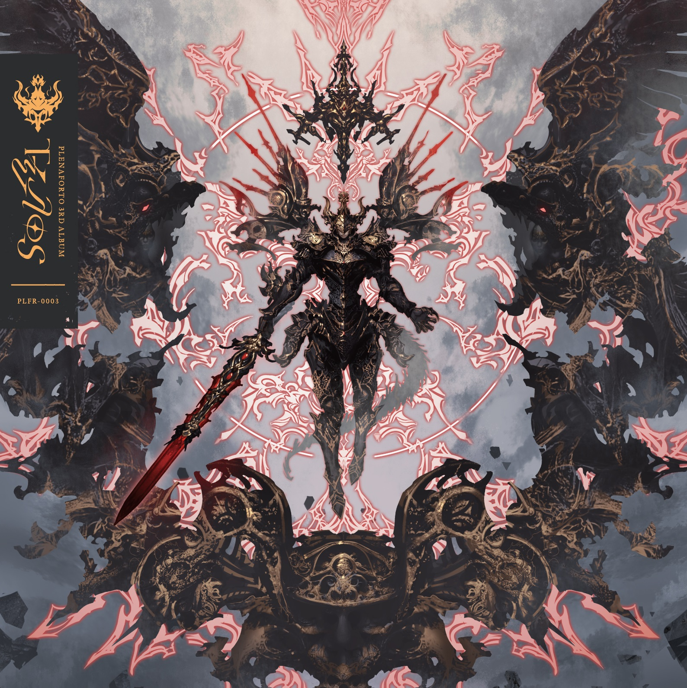

<!--  -->

*Note: I've uploaded all songs on my youtube.*

During spring this year, I had browsed through the upcoming albums being released at M3-51. I didn't listen to many crossfades because I wasn't feeling it at the time, but one album stood out to me. Τέλος was a very interesting name to give to an album, and Plena Forto had many known artists compsing, people like Feryquitous, Noah, and Satella, but I had oddly enough never heard of this circle. 
